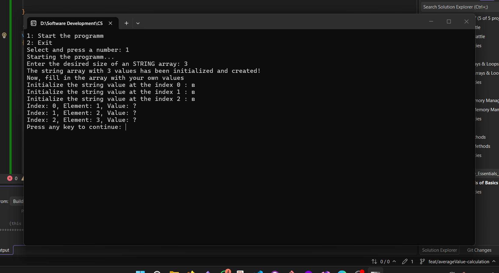
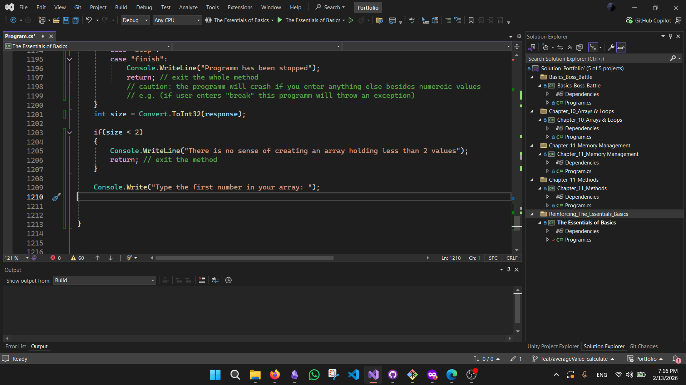

# C# Learning Projects (Basics & OOP)
## Simple Console Apps In C# using Visual Studio

 


Welcome to my coding journey! This repository contains my solutions to exercises from **"The C# Player's Guide (5th Edition)"**.

## 📂 Project Structure
Each chapter has its own dedicated folder:
* **Boss Battles:** Big challenges combining multiple concepts.
* **Experiments:** My personal tests and "what if" scenarios.


## 🚀 Technologies Used
* Language: **C# 14**
* Framework: **.NET 10**
* IDE: **Visual Studio 2026** & **VS Code**
* Version Control: **Git & GitHub**

## 💡 Key Learnings
### Arrays & Loops 

Here's some things I've learned during my path:

```csharp
// working with arrays and loops
int[] arr = new[4];

for(int index = 0; index < arr.Length; index++)
{
  Console.Write("Type a number at index {index}: ");
  // string ---> int (and putting an inputted number in the variable "number" to store it)
  int number = int.Parse(Console.ReadLine()); // conversion of what user typed to string 
  arr[index] = number;
  Console.WriteLine($"Element at index {index}: {arr[index]});
  continue;
}
```

## Goals To Accomplish 🚀
- 🔃 understand how tryParse and goto method work
- 🔃  finish the arrays
- 🔃 make a conflict between local and remote repo
- 🔃 understand how git and github work (video from watch later section on YT)
- 🔃 make and implement unusal ways of creating diffrent things (arrays, if-else statements, math etc.)
- 🔃 Make a pet-project

## Technologies Used

 **C#**

**.NET**

**Visual Studio**

**VS Code** (only for editing readme files)

**Git \& GitHub**

## Here are some Screenshots of what I've done:






